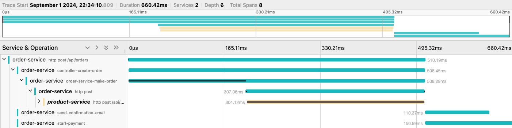

# Spring Boot 3 with Micrometer and OpenTelemetry Integration

This project demonstrates how to integrate Micrometer and OpenTelemetry 
into a Spring Boot 3 application. The setup includes configurations for both 
synchronous and asynchronous tracing, with the traces being sent to Jaeger for 
visualization.

## Usage 

Run [docker-compose.yml](docker-compose.yml).

Run applications `order-service` and `product-service`

### After sending a request to http://localhost:8080/api/orders, you can view the traces in Jaeger.
